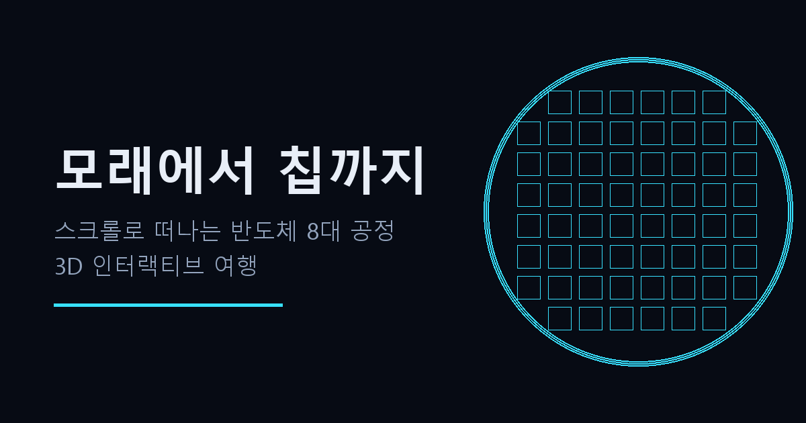

# 모래에서 칩까지 · From Sand to Chip

> 모래 한 줌이 수백억 트랜지스터의 칩이 되기까지 — 스크롤로 떠나는 반도체 8대 공정 3D 여행.
> A scroll-driven 3D journey through the 8 core semiconductor processes — from a handful of sand to a chip with tens of billions of transistors.

| | |
|---|---|
| 🇰🇷 한국어 | **https://stkeo.github.io/sand-to-chip/** |
| 🇺🇸 English | **https://stkeo.github.io/sand-to-chip/en.html** |



## 무엇이 들어 있나 · What's inside

- **12개의 스크롤 연동 3D 씬** (three.js r128) — 히어로·피날레 + 10개 공정 씬: 정제·잉곳 성장(CZ)·웨이퍼·산화·포토(EUV)·식각·증착/이온주입·배선/CMP·EDS 테스트·패키징(HBM/CoWoS)
- **인터랙티브 실험실 위젯 9종** — 모든 공정 스테이지가 만질 수 있는 계기판:
  레일리 해상도(CD=k₁·λ/NA)+DOF · 멀티패터닝(LELE/SADP/SAQP) · MOSFET 스위치(제곱법칙) · 재진입 루프 카운터 · 수율 실험실(푸아송/머피/음이항)+양품당 원가 · HBM 대역폭 계산기 · 나노 스케일 자 · 무어의 법칙 차트 · 복습 퀴즈
- **KO/EN 이중언어** — 언어 토글·hreflang·언어별 OG 카드
- **PWA** — 오프라인 완전 동작(서비스워커 프리캐시), 홈 화면 설치 가능
- **접근성** — 키보드 내비(←/→·J/K), 스크린리더 라이브 리전, reduced-motion 전면 대응, JS-off에서도 본문 판독 가능, 인쇄 스타일

## 구조 · Architecture

- 언어별 **단일 HTML 파일**(`index.html`/`en.html`) — 외부 네트워크 의존성 0(로컬 `three.min.js`), GitHub Pages 정적 호스팅
- 3D는 스테이지별 `THREE.Group` 크로스페이드 + 스크롤 위치 기반 국소 진행도, 스테이지 액센트 컬러가 UI 크롬(진행바·레일)과 3D 라이팅·안개에 동시 전파
- 콘텐츠 수치는 공개 산업 자료 기준(2026-07), 위젯 수식은 실제 물리·산업 모델

## 검증 · Verification

```bash
python smoke.py   # 180 checks
```

구조 무결성 · KO/EN 코드 골격 동일성 · 영문판 한글 잔존 0 · 액센트 팔레트 동기 · 서비스워커 프리캐시 · 위젯 수식 재계산 · 퀴즈 정답 무결성 · i18n/SEO 배선을 자동 검사한다.

## 자매 프로젝트 · Sister project

🏭 **클린룸 타이쿤 · Cleanroom Tycoon** — 직접 팹을 운영해보는 3D 교육 게임: https://stkeo.itch.io/cleanroom-tycoon

---

이 사이트는 **Claude Fable 5**가 three.js로 설계·제작했습니다. Designed and built by **Claude Fable 5**.

© 2026. 별도 라이선스 표기 전까지 모든 권리 보유 · All rights reserved until a license is granted.
